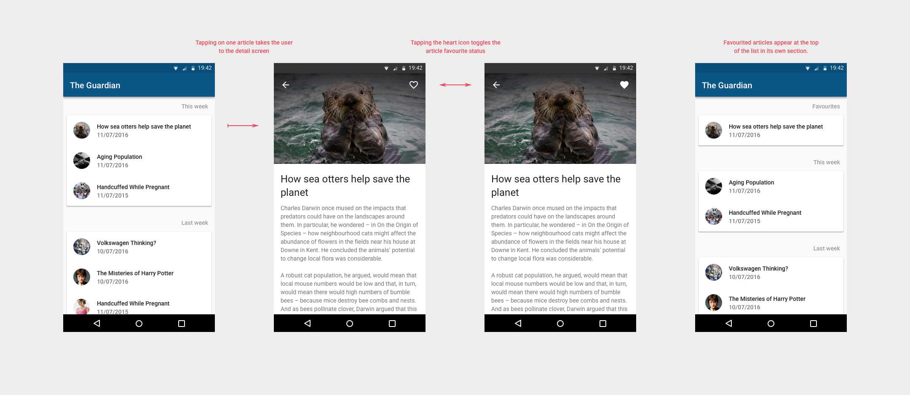

# Monzo Code Test for Android Engineers

## Instructions

A developer at your company has been working on an app called "Headlines". The app uses the Guardian's news API to fetch headlines and display them to the user. Users can favourite articles that they like.

You've inherited their unfinished project, which includes a [design mockup](The_Guardian.png). It looks like the project might have some bugs, and the user interface definitely needs some work.

Your job, as the sole developer, is to add the missing features shown in the enclosed specification, fixing any bugs you might come across and prioritising as you see fit. Feel free to re-work any aspect of the codebase you're not happy with, within the bounds of the original spec.

You should spend no more than 2 hours on the project. We know this isn't anywhere near enough time to complete the spec, so no pressure to build all the features or fix all the bugs! Aim for fixing bugs and implementing one feature. 

We're interested to see the decisions you make along the way. Please include a short note with your response, explaining:
- What were your priorities, and why?
- If you had another two days, what would you have tackled next?
- What would you change about the structure of the code?
- What bugs did you find but not fix?
- What would you change about the visual design of the app?
- Approximately how long you spent on this project.

We'd love it if you could try and get this back to us within a week, but please let us know if you need longer, so we don't check-in with you too early 😊
Make a zip of your solution and upload it to the link in the email inviting you to this repository.

### Guardian API Key

Note that you might need to replace the guardian API key for this project if [this link](https://content.guardianapis.com/search?api-key=09658731-cb6d-4a84-9e3c-5f030389de4e) doesn't work. To get a new key, go to https://bonobo.capi.gutools.co.uk/register/developer and register yourself as a developer. Once you get your key, replace the string [here](https://github.com/monzo/android-code-test/blob/49a8e3513b3da3c6ad6a1972dac23e3a74160887/app/src/main/res/values/api_constants.xml) with your key and you should be good to go!

### Java Version

To run the project on Android Studio, you will need to be using the JDK 17. You can change the JDK via `Preferences > Build, Execution, Deployment > Build Tools > Gradle > Gradle JDK`.
